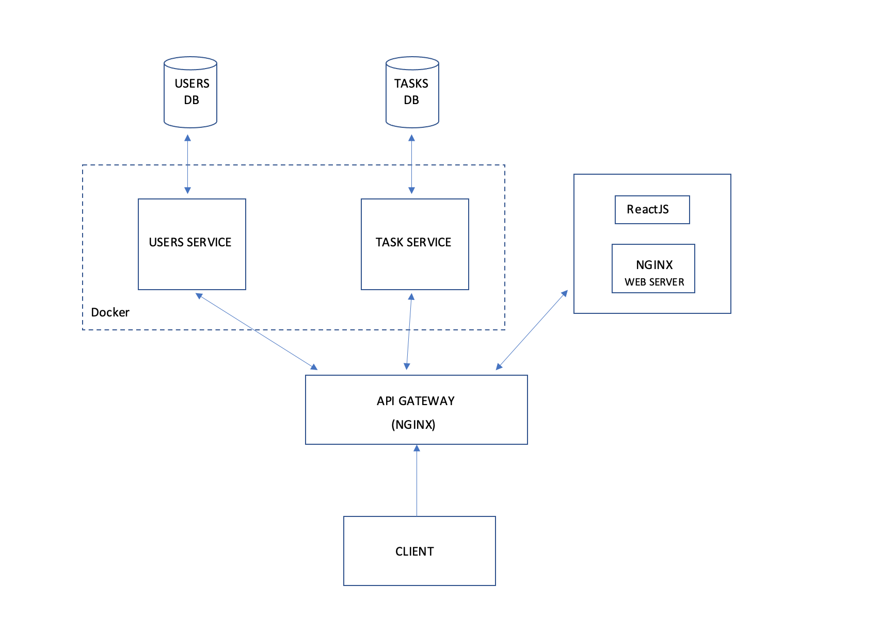

[](https://opensource.org/licenses/MIT)
 
# USER'S TASK MANAGEMENT

> User's Task management app helps to manage user's task

> [users service](https://user--serv.herokuapp.com/).

> [tasks service](https://task--serv.herokuapp.com/).

## Architectural Diagram

 

## Getting Started

### Installation

To install and run this project you would need to have the following installed:

- Node.js
- Docker
- Docker-compose [learn more](https://docs.docker.com/compose/install/)
- GIT

1. Clone this repository into your local machine:
```
e.g git clone https://github.com/mquadrant/users-tasks-repo.git
```
2. Build all the services:

```
sudo docker-compose build
```
3. Start all the services:

```
sudo docker-compose up
```
#### Production Containers
1. Build services image:
```
sudo docker-compose -f docker-compose.prod.yml build
```
2. Start services in background:
```
sudo docker-compose -f docker-compose.prod.yml up -d
```
## Built With
* ExpressJS
* NodeJS
* Docker
* Mongoose / MongoDb
* POSTMAN
* AWS EC2
* NGINX
* GIT

## API Documentation

### Base URL
```
http://ec2-18-191-17-243.us-east-2.compute.amazonaws.com/
```

> [API Doc](https://documenter.getpostman.com/view/8220979/TVt19QkS).

## Author
*  [Mark Benjamin](https://twitter.com/mquadrant)

## License
This project is licensed under the MIT license - see the LICENSE.md file for details.